# ARQ Astra — End-to-End Solution Architecture

**Document type:** Solution Architecture Definition (ARB-ready)
**System:** ARQ Astra — Tally → Cloud Receivables & Business Intelligence for Indian SMBs
**Repository:** `github.com/RishieRich/ArcAstraOneAru` (mono-repo, three deploy targets)
**Version:** 1.1
**Date:** 2026-07-26
**Status:** Live in production (single-tenant-per-client, early customers)
**Author / Owner:** Rishikesh Rajendra Pote
**Verified against commit:** `b76d7e5`

> Public trial signup, the 10-user capacity gate, waitlist persistence and adaptive
> Profit & Loss imports were migrated and deployed to production on 2026-07-26.

---

## 0. How to use this document

> **If you are an LLM (Claude UI / ChatGPT / any assistant) reading this file:**
>
> This document is a **complete, self-contained architecture source of truth**. You have
> everything you need — no repo access required. Use it to produce any of:
>
> 1. **An ARB (Architecture Review Board) deck** — the slide-by-slide blueprint is in
>    [§20](#20-arb-deck-blueprint). Every slide names the section that feeds it.
> 2. **C4 model diagrams** — Levels 1–3 are already authored in Mermaid in
>    [§5](#5-c4-level-1--system-context)–[§7](#7-c4-level-3--component-views). Re-render,
>    restyle, or convert to Structurizr DSL / PlantUML / draw.io as needed.
> 3. **Sequence / flow diagrams** — [§10](#10-end-to-end-flows-sequence-diagrams).
> 4. **A data model / ERD** — [§11](#11-data-architecture).
> 5. **A security architecture review** — [§13](#13-security-architecture).
> 6. **A risk register, ADR log, or roadmap** — [§17](#17-architecture-decision-records-adrs)–[§19](#19-roadmap).
>
> **Rules when generating from this document:**
> - Do **not** invent components, vendors, or metrics that are not stated here. If a number
>   is required and not present, mark it `TBD` and list it under "Open questions".
> - Items flagged **`[GAP]`** are known weaknesses — surface them honestly in the deck's
>   risk slide rather than hiding them. An ARB values candour over polish.
> - Items flagged **`[ASSUMPTION]`** are inferred, not measured. Label them as such.
> - Keep every diagram in a fenced code block tagged `mermaid`, so it renders in Claude
>   artifacts, GitHub, and Notion.
> - Default deck length: **18–22 slides**. Ask before exceeding that.

**Suggested one-line prompt:**
> "Read this architecture document and produce the ARB deck described in §20, as an HTML
> artifact with Mermaid diagrams inline, one slide per section."

---

## 1. Executive summary

**The problem.** An Indian small business runs its books in **TallyPrime** — a Windows
desktop accounting application on one PC in the office. Tally holds the truth about who owes
the business money, but that truth is trapped: it is not on the owner's phone, not visible
when they travel, not shareable with a partner, and not queryable in plain language. Owners
routinely do not know their own outstanding position without asking their accountant to open
Tally and read a report aloud.

**The solution.** ARQ Astra is a three-part system that lifts receivables data out of Tally
into a cloud dashboard, **without ever writing back to Tally and without any manual data
entry**:

1. A small **Windows desktop connector** (`arq-connector.exe`) sits next to Tally, reads it
   **read-only** over Tally's local XML/HTTP gateway on port 9000, and pushes a normalized
   snapshot to the cloud on a schedule.
2. A **FastAPI backend** on Vercel serverless functions receives, validates, de-duplicates and
   stores those snapshots in **Neon Postgres**, and computes every dashboard metric.
3. A **React dashboard** gives the owner receivables analytics, an optional Excel-upload path
   for sales/purchase/expense data, and an **AI copilot** that answers questions in English,
   Hinglish or Gujarati-Roman.

**Why it matters architecturally.** The hard constraint is that the system of record is a
desktop application on an unmanaged consumer PC, behind a home/office NAT, with no API, no
webhooks, and no outbound push capability of its own. The architecture is therefore an
**agent-based, client-initiated, snapshot-push pipeline** — not an integration, not an ETL
job, and not a database replication. Every design decision downstream follows from that one
constraint.

**Current state.** Production-live on Vercel with real customer data flowing. Three
components, one repository, four applied database migrations, nine public API endpoints,
zero-to-low operating cost (all free tiers).

---

## 2. Business context

### 2.1 Users and personas

| Persona | Who they are | What they need | How they touch the system |
|---|---|---|---|
| **Business owner** (primary) | Owner/proprietor of an Indian SMB, ₹1–50 Cr turnover. Not technical. May prefer Hinglish or Gujarati over English. | "Who owes me money, how much is overdue, who should I chase today?" | Web dashboard on phone/laptop; AI copilot |
| **Accountant / operator** | The person who actually runs Tally in the office | Zero extra work; must not risk the Tally data file | Installs the connector once; otherwise invisible |
| **ARQ admin** (you) | Product owner / operator | Onboard a client, issue pairing codes, scope dashboard access, revoke a lost device | `python -m app.admin` CLI against Neon |
| **Partner / CA (future)** | Chartered accountant with several client companies | View multiple companies from one login | Already enabled by `dashboard_user_tenants` scoping (migration 0004) |

### 2.2 Business drivers

| Driver | Architectural consequence |
|---|---|
| Owner has **no IT department** | Installation must be a single exe + a 6-character pairing code. No VPN, no port forwarding, no static IP, no cloud agent enrolment. |
| Tally data is the **business's crown jewels** | Read-only by contract. The connector issues only Export/Collection XML requests — never an Import or Alter request. This is a non-negotiable trust promise. |
| Owner is **cost-sensitive** and ARQ is pre-revenue | Whole stack sits on free tiers (Vercel Hobby, Neon free, Gemini free tier). Architecture must degrade gracefully on those tiers, not assume them away. |
| Owner is **not comfortable in English** | Trilingual UI (EN / Hinglish / Gujarati-Roman) is a first-class requirement, enforced by a central `i18n.js` — never hardcoded strings. |
| Money must "look right" to an Indian reader | Lakh-crore digit grouping (`₹1,25,000`, not `₹125,000`) everywhere, including in LLM output — enforced by system prompt. |

### 2.3 Scope

**In scope (built and live)**
- Read-only Tally extraction: Sundry Debtor ledgers + Bills Receivable
- Scheduled unattended sync (default every 3 hours) via Windows Task Scheduler
- Device pairing, device tokens, per-company binding, device revocation
- Receivables analytics: outstanding, overdue, aging buckets, top debtors, chase list,
  due timeline, concentration risk, alerts
- Optional Tally `.xlsx` import for Sales / Purchase / Expense with auto-classification
- Derived business metrics: monthly trend, operating result, margin, category and
  counterparty breakdowns
- AI copilot Q&A over the tenant's own snapshot, trilingual, with provider failover
- Dashboard auth (email + password/PIN) with optional per-company access scoping
- Guided public free-trial workspace, first-10 capacity gate and overflow waitlist
- Adaptive Profit & Loss summary normalization alongside Sales/Purchase/Expense uploads

**Explicitly out of scope (today)**
- Writing anything back into Tally
- Payments, collections, reminders, or WhatsApp/SMS dunning
- Payables (Bills Payable) — only receivables are extracted from Tally live
- Statutory reporting, GST filing, or an audit-grade P&L
- Multi-user roles/permissions beyond "which companies can this email see"
- Mobile native app (the dashboard is responsive web)
- Real-time sync (the model is deliberately snapshot-based, 3-hour default)

---

## 3. Requirements

### 3.1 Functional requirements

| ID | Requirement | Where implemented |
|---|---|---|
| FR-01 | Detect whether TallyPrime is running, its gateway is open, and the configured company is loaded | `connector/tally/detect.py` (`run_doctor`) |
| FR-02 | Launch Tally automatically if closed when a scheduled sync fires | `connector/tally/launcher.py` |
| FR-03 | Extract Sundry Debtor ledgers and Bills Receivable as XML, read-only | `connector/tally/envelopes.py`, `client.py` |
| FR-04 | Pair a device to a tenant with a one-time, expiring code | `POST /v1/devices/register` |
| FR-05 | Push a normalized snapshot; retries must not duplicate data | `POST /v1/sync` (idempotent by `sync_run_id`) |
| FR-06 | Run unattended on a schedule without user interaction | `connector/scheduler.py` (schtasks) |
| FR-07 | Authenticate a dashboard user and issue a session | `POST /v1/auth/login` |
| FR-08 | List the companies a user may see | `GET /v1/dashboard/companies` |
| FR-09 | Return every dashboard number for one company in one call | `GET /v1/dashboard/metrics/{tenant_id}` |
| FR-10 | Accept, classify and import a Tally `.xlsx` workbook | `POST /v1/imports/financials` |
| FR-11 | Answer natural-language questions over the tenant's data, trilingually | `POST /v1/ask` |
| FR-12 | Render the whole dashboard in EN / Hinglish / Gujarati-Roman | `frontend/src/i18n.js` |
| FR-13 | Create at most 10 isolated self-service trial accounts and waitlist overflow leads | `GET /v1/auth/signup/status`, `POST /v1/auth/signup` |
| FR-14 | Guide trial users from adaptive Excel upload through metrics, AI Q&A and one-page reports | `TrialGuide.jsx`, `FinancialUpload.jsx`, `Copilot.jsx` |

### 3.2 Non-functional requirements

| ID | Category | Target | Current status / evidence |
|---|---|---|---|
| NFR-01 | **Availability** | Dashboard reachable ≥99% business hours | Vercel edge + serverless; single region `bom1`. Neon free tier suspends after ~5 min idle → mitigated by connect retry (ADR-008) |
| NFR-02 | **Sync latency** | Data no more than one sync interval stale (default 3 h, configurable) | Snapshot model; not real-time by design |
| NFR-03 | **Sync durability** | A retried push must never double-count | Enforced: `sync_runs.id` primary key + `on conflict do nothing` (ADR-005) |
| NFR-04 | **Dashboard response** | Metrics call < 3 s warm | Single round trip; all aggregation in SQL. **`[ASSUMPTION]` — not load-tested** |
| NFR-05 | **Cold start** | Backend cold start < 3 s | Kept lean deliberately: no LLM SDKs, stdlib `urllib` for AI calls (ADR-007) |
| NFR-06 | **Security** | Tally data never modified; no secret in any file or log | Read-only envelopes; token in Windows Credential Manager; logs carry counts only |
| NFR-07 | **Data minimisation** | Uploaded Excel files are never retained | Parsed in memory, only derived rows persisted; SHA-256 kept for dedup |
| NFR-08 | **Localisation** | 100% of user-facing strings in 3 languages | Enforced by convention + `i18n.js` |
| NFR-09 | **Cost** | ≤ ₹0/month at current scale | Vercel Hobby + Neon free + Gemini free tier |
| NFR-10 | **Portability** | Client install with no admin rights | Current-user scheduled task; `%LOCALAPPDATA%` settings; PyInstaller single exe |

---

## 4. Solution overview and design principles

### 4.1 The shape of the solution in one paragraph

A **pull-from-local, push-to-cloud agent** runs on the client's Windows PC. It speaks Tally's
native XML/HTTP dialect locally (`localhost:9000`), converts responses into a small normalized
JSON snapshot, and posts that snapshot over HTTPS to a stateless serverless API authenticated
by a per-device bearer token. The API is the only writer to a managed Postgres database. A
separate browser SPA reads pre-aggregated metrics from that same API using a different,
deliberately isolated auth scheme, and an LLM answers questions by being handed a serialised
copy of that one tenant's snapshot in the prompt.

### 4.2 Design principles (and what each one bought us)

| # | Principle | Consequence |
|---|---|---|
| P1 | **Read-only at the source, always** | Only `Export` / `Collection` XML request types. The connector has no code path that could mutate Tally. Trust is the product. |
| P2 | **Client-initiated, outbound-only networking** | No inbound port, no NAT traversal, no tunnel, no static IP. The client PC only ever makes outbound HTTPS calls. Massively simplifies deployment into unmanaged homes/offices. |
| P3 | **Stateless backend** | Every serverless invocation is a fresh process. No server-side session store — dashboard sessions are self-contained signed tokens (ADR-004). |
| P4 | **Idempotency by client-generated ID** | The connector mints the `sync_run_id`; the backend treats a repeat as "return the earlier result". Retries are free and safe (ADR-005). |
| P5 | **Two separate auth populations** | Devices and humans never share a credential type or a code path. A stolen device token cannot read the dashboard; a leaked dashboard token cannot push data. |
| P6 | **Stdlib-first, dependency-hostile** | Fewer packages → smaller lambda → faster cold start → cheaper. AI calls use `urllib`, process checks use `tasklist`, scheduling uses `schtasks`. |
| P7 | **Compute in SQL, not in Python** | The metrics endpoint is one DB round trip of aggregate queries, not row-by-row Python. Keeps the serverless function short-lived. |
| P8 | **Store raw, present derived** | The DB keeps Tally's own sign convention (receivables are negative); `abs()` is applied at the presentation boundary only. The database never lies about what Tally said (ADR-006). |
| P9 | **Additive-only schema migrations** | Every migration is `create if not exists` / `add column if not exists`. Safe to re-run against the live seeded DB. Nothing drops or truncates. |
| P10 | **Graceful degradation over hard failure** | Neon asleep → retry. Gemini down → Groq. AI unconfigured → 503 with a fixable message, never a 500. No receivables data → dashboard still renders the Excel-derived view. |

---

## 5. C4 Level 1 — System Context

> Who and what ARQ Astra talks to. No internals.

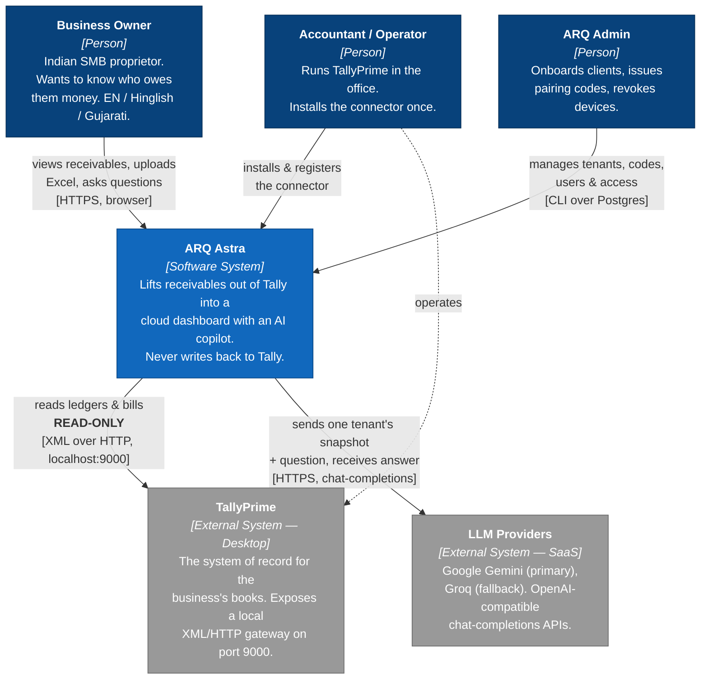

**Context notes for the ARB**
- The only external systems are **TallyPrime** (local, on the client's PC) and the **LLM
  providers** (SaaS). There is no ERP, no payment gateway, no CRM, no messaging provider.
- The Tally arrow is **unidirectional and read-only**. This is the single most important
  fact on this slide.
- The LLM arrow carries **one tenant's business data** — see [§13.5](#135-data-classification-and-flow-to-third-parties) for the data-sharing implications.

---

## 6. C4 Level 2 — Container view

> The deployable/runnable units and the protocols between them.

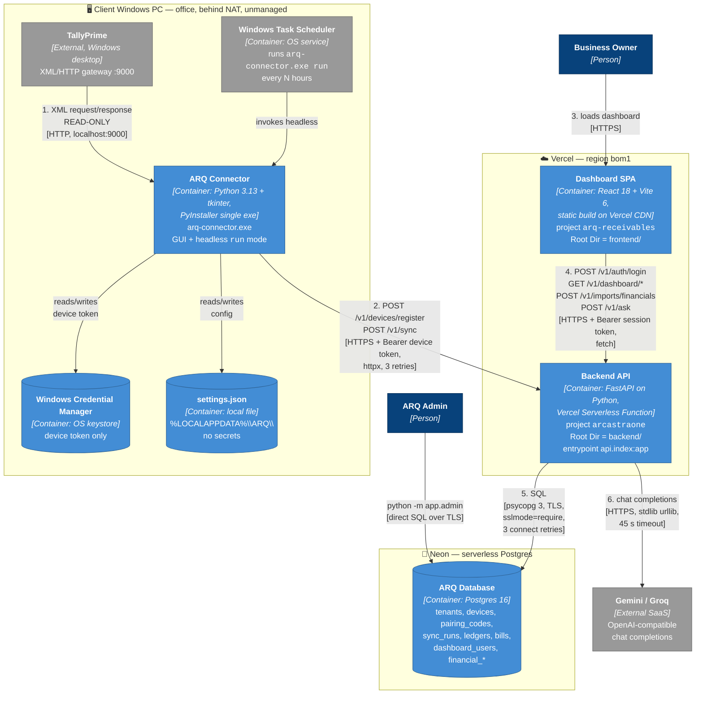

### 6.1 Container responsibilities

| Container | Runtime | Responsibility | Explicitly NOT responsible for |
|---|---|---|---|
| **ARQ Connector** | Python 3.13, tkinter, PyInstaller exe, client PC | Detect Tally health, launch Tally if needed, extract & parse XML, build snapshot, push with retries, manage its own scheduled task, store the device token in the OS keystore | Any business calculation. Any write to Tally. Any persistence of business data (it holds the snapshot only in memory for the duration of one push). |
| **Backend API** | FastAPI on Vercel Serverless (Fluid Compute), Python | Authenticate devices and dashboard users, validate and persist snapshots idempotently, compute **every** metric in SQL, classify and ingest Excel workbooks, orchestrate the LLM call with failover | Holding session state. Storing uploaded files. Talking to Tally. |
| **Dashboard SPA** | React 18 + Vite 6, static assets on Vercel CDN | Render metrics, own the three-language UI, hold the session token in `localStorage`, upload workbooks, host the copilot chat | Any calculation. Every number on screen comes pre-computed from `/v1/dashboard/metrics`. |
| **ARQ Database** | Neon serverless Postgres | System of record for the cloud side; enforces tenancy, uniqueness, idempotency and referential integrity | Business logic (no stored procedures, no triggers). |
| **Admin CLI** | Python, run locally by the operator against Neon | Tenant creation, pairing-code issuance, device revocation, dashboard-user lifecycle, per-company access grants | Anything a customer touches. It is an operator tool, not a product surface. |

---

## 7. C4 Level 3 — Component views

### 7.1 Backend API components

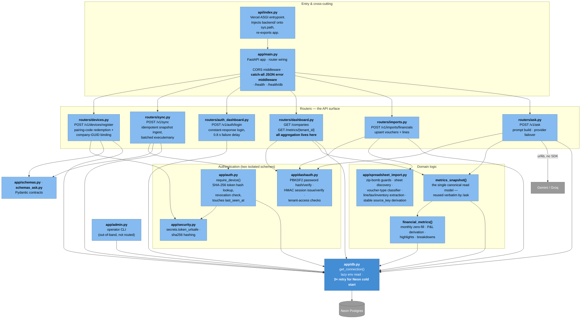

**Key component notes**
- **`metrics_snapshot()` is the read model.** The dashboard endpoint returns it directly, and
  `/v1/ask` serialises the *same* function's output into the prompt. There is exactly one
  definition of "the company's numbers" — the AI can never disagree with the dashboard.
- **The catch-all middleware in `main.py` is load-bearing.** On Vercel's Python runtime an
  escaped exception kills the invocation and the client receives Vercel's opaque
  `FUNCTION_INVOCATION_FAILED` HTML page instead of JSON. The middleware guarantees a parseable
  `{"detail": ...}` body always. **Do not remove it** (see ADR-008, `ERROR101_RESOLUTION.md`).
- **`auth.py` and `dashauth.py` never call each other.** Deliberate isolation (P5).

### 7.2 Connector components

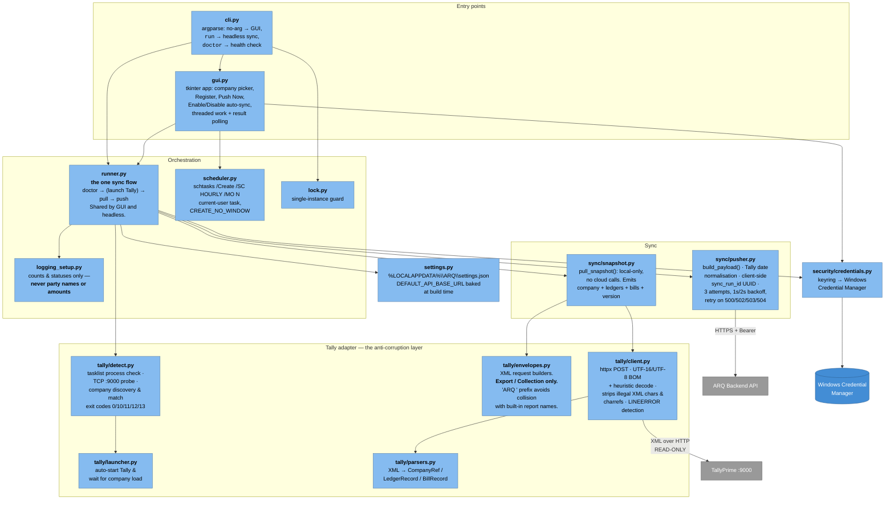

### 7.3 Dashboard SPA components

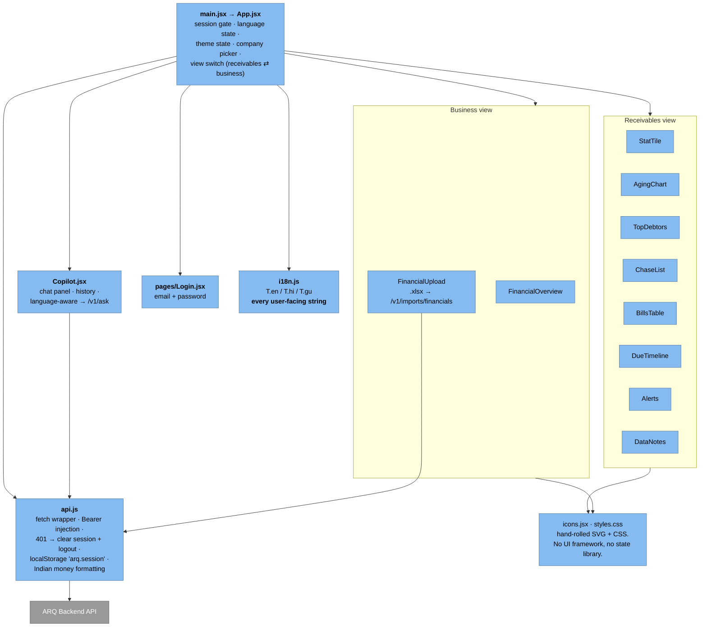

---

## 8. Logical architecture — capability view

> Technology-agnostic. Useful as the "what the system does" slide before the "how" slides.

```mermaid
flowchart LR
    classDef cap fill:#e8f0fe,stroke:#4285f4,color:#000
    classDef xcut fill:#fff4e5,stroke:#f59e0b,color:#000

    subgraph L1["① Acquisition"]
        A1["Source health<br/>detection"]:::cap
        A2["Read-only<br/>extraction"]:::cap
        A3["Parse &<br/>normalise"]:::cap
        A4["Scheduled<br/>orchestration"]:::cap
    end

    subgraph L2["② Transport & Trust"]
        B1["Device<br/>pairing"]:::cap
        B2["Token<br/>authentication"]:::cap
        B3["Idempotent<br/>ingestion"]:::cap
        B4["Retry &<br/>backoff"]:::cap
    end

    subgraph L3["③ Persistence"]
        C1["Multi-tenant<br/>isolation"]:::cap
        C2["Snapshot<br/>history"]:::cap
        C3["Upsert /<br/>dedup"]:::cap
        C4["Referential<br/>integrity"]:::cap
    end

    subgraph L4["④ Analytics"]
        D1["Receivables<br/>aggregation"]:::cap
        D2["Aging &<br/>overdue"]:::cap
        D3["Risk signals<br/>& alerts"]:::cap
        D4["P&L-style<br/>derivation"]:::cap
    end

    subgraph L5["⑤ Experience"]
        E1["Auth &<br/>session"]:::cap
        E2["Visualisation"]:::cap
        E3["Trilingual<br/>UX"]:::cap
        E4["Conversational<br/>AI"]:::cap
        E5["Self-serve<br/>Excel import"]:::cap
    end

    L1 --> L2 --> L3 --> L4 --> L5

    subgraph X["Cross-cutting"]
        X1["Secret<br/>management"]:::xcut
        X2["PII-safe<br/>logging"]:::xcut
        X3["Graceful<br/>degradation"]:::xcut
        X4["Additive<br/>migrations"]:::xcut
    end
```

| Layer | Capability | Realised by |
|---|---|---|
| ① Acquisition | Source health detection | `detect.run_doctor` — process, port, gateway, company match with distinct exit codes |
| | Read-only extraction | `envelopes.py` — `Export` / `Collection` request types only |
| | Parse & normalise | `parsers.py` + `client.decode_tally_response` (UTF-16/UTF-8 detection, illegal-char stripping) |
| | Scheduled orchestration | `scheduler.py` → Windows Task Scheduler, hourly `/MO N` |
| ② Transport & Trust | Device pairing | One-time hashed pairing code, 72 h expiry, `used_at` burn |
| | Token authentication | SHA-256 token hash + revocation check on every request |
| | Idempotent ingestion | Client-minted `sync_run_id` + `on conflict do nothing` |
| | Retry & backoff | `pusher.py` 3 attempts, exponential 1 s/2 s, retryable-status allowlist |
| ③ Persistence | Multi-tenant isolation | `tenant_id` FK on every business table; company-GUID binding |
| | Snapshot history | `bills` is append-only per `sync_run_id` |
| | Upsert / dedup | `ledgers` upsert on `(tenant_id, tally_guid)`; `financial_transactions` upsert on `(tenant_id, kind, source_key)`; file SHA-256 uniqueness |
| ④ Analytics | Receivables aggregation | `metrics_snapshot()` — SQL aggregates in one connection |
| | Aging & overdue | Bucketed by `overdue_days`, magnitudes via `abs()` |
| | Risk signals | Concentration %, largest bill, top party, alert list |
| | P&L-style derivation | `financial_metrics()` — zero-filled monthly series, operating result, margin, cost ratio |
| ⑤ Experience | Auth & session | PBKDF2 password + stateless HMAC session token |
| | Visualisation | Hand-built React components, no chart library |
| | Trilingual UX | `i18n.js` with `en` / `hi` (Hinglish) / `gu` (Gujarati-Roman) |
| | Conversational AI | `/v1/ask` with snapshot-in-prompt, provider failover, language mirroring |
| | Self-serve Excel import | `spreadsheet_import.py` classifier + `/v1/imports/financials` |

---

## 9. Technology stack inventory

### 9.1 Full stack table

| Layer | Technology | Version / detail | Why this, and what it replaced |
|---|---|---|---|
| **Source system** | TallyPrime | Licensed edition required for unattended runs | The customer's existing system of record. Non-negotiable. Educational mode ignores `tally.ini` company preload — a Tally limitation, not a bug. |
| **Source protocol** | Tally XML/HTTP gateway | `http://localhost:9000` | Tally's only programmatic interface. No REST, no ODBC in scope. |
| **Connector language** | Python | 3.13 | Same language as the backend → one mental model, shared parsing idioms. |
| **Connector GUI** | tkinter | stdlib | Zero extra dependency, ships inside PyInstaller cleanly, no runtime install for the user. Rejected Electron (100 MB+ bundle) and PyQt (licensing + size). |
| **Connector HTTP** | httpx | ≥0.27 | Modern client with a pluggable `transport` — which is what makes the pusher unit-testable offline. |
| **Connector secrets** | keyring | ≥25 | Fronts **Windows Credential Manager**. Rejected: config file (readable), DPAPI directly (more code, same outcome). |
| **Connector packaging** | PyInstaller | ≥6.10, `arq-connector.spec`, `build.ps1` | Single `dist\arq-connector.exe`, no Python install on the client PC. |
| **Connector scheduling** | Windows Task Scheduler via `schtasks` | current-user task | No admin rights, no service install, no extra dependency. Rejected: a resident background service (needs elevation, harder to uninstall). |
| **Backend framework** | FastAPI | ≥0.134 | Pydantic-native request validation = the API contract is the code. First-class ASGI for Vercel. |
| **Backend validation** | Pydantic | ≥2.7 | `schemas.py` is the wire contract shared conceptually with `pusher.build_payload`. |
| **DB driver** | psycopg | ≥3.2 (`[binary]`) | Native `executemany` pipelining — one round trip per batch instead of per row. Matters for thousands of bills. |
| **Config** | python-dotenv | ≥1.0 | Local `.env`; on Vercel the file is absent and env vars come from project settings. |
| **Excel parsing** | openpyxl | ≥3.1 | Read-only `.xlsx`. **Deliberate runtime dependency** — must stay in *both* `pyproject.toml` and `requirements.txt`. |
| **LLM access** | Python stdlib `urllib` | — | **No vendor SDK by design** (ADR-007). Both providers speak the OpenAI chat-completions dialect, so one request shape serves both. Keeps the lambda small and cold starts fast. |
| **LLM primary** | Google Gemini | `gemini-flash-latest` (alias — never goes stale) via the OpenAI-compatible endpoint | Free tier, fast, strong at Indic-Roman script mirroring. |
| **LLM fallback** | Groq | `llama-3.3-70b-versatile` | Different vendor, different failure domain, very low latency. |
| **Backend hosting** | Vercel Serverless Functions (Fluid Compute) | project `arcastraone`, Root Dir `backend`, region `bom1` | Zero ops, scales to zero, free tier. `[tool.vercel] entrypoint = "api.index:app"` is **required** — the FastAPI preset finds several ASGI `app` objects and refuses to guess. |
| **Database** | Neon serverless Postgres | `sslmode=require&channel_binding=require` | Postgres semantics (upserts, JSONB, constraints) with scale-to-zero pricing. Free tier suspends compute after ~5 min idle → mitigated by ADR-008. |
| **Frontend framework** | React | 18.3 | Ubiquitous, no lock-in. |
| **Frontend build** | Vite | 6.0 | Fast builds; `VITE_API_BASE_URL` is inlined **at build time** — changing it requires a redeploy, not just an env edit. |
| **Frontend UI** | Hand-rolled CSS + SVG (`styles.css`, `icons.jsx`) | — | **No UI framework, no state library, no chart library.** Total control of the trilingual layout and the Indian number formatting; near-zero bundle. |
| **Frontend hosting** | Vercel static + CDN | project `arq-receivables`, Root Dir `frontend` | Same platform as the API, separate project so the two deploy independently. |
| **Session storage** | Browser `localStorage` key `arq.session` | — | Stateless backend requires client-held session. See [§13.4](#134-known-weaknesses-gap) for the XSS trade-off. |
| **Testing** | pytest | ≥8.0 | Connector tests run offline against **real captured Tally XML fixtures**. Backend tests hit the live Neon DB — **not hermetic** `[GAP]`. |
| **Migrations** | Raw SQL + `migrations/run_migration.py` | 0001–0004 | Additive-only, idempotent. Rejected Alembic: four migrations do not justify the machinery. |
| **Source control** | Git / GitHub, single `main` branch | `RishieRich/ArcAstraOneAru` | Mono-repo keeps the wire contract (`schemas.py` ↔ `pusher.py`) in one commit. |

### 9.2 Deliberate non-choices

An ARB will ask why these are absent. The answers are principled, not accidental:

| Not used | Why not |
|---|---|
| Message queue / event bus | The whole pipeline is one client-initiated HTTP call per sync. A queue would add a component to operate for zero benefit at this volume. |
| Kubernetes / containers | Serverless removes the ops surface entirely. Nothing here is long-running. |
| Redis / cache layer | Metrics are one SQL round trip and data changes at most every 3 hours. Caching would add a staleness bug class for no measurable win. |
| ORM (SQLAlchemy) | All queries are aggregate SQL. An ORM would obscure exactly the part that needs to stay readable and tunable. |
| Vendor LLM SDK | Cold-start weight. Both providers are OpenAI-compatible over plain HTTP. |
| Auth provider (Auth0 / Clerk) | The user population is people you personally hand accounts to. Two auth schemes, ~120 lines, no vendor, no per-MAU cost. Revisit at self-serve signup. |
| Object storage for uploads | Uploaded workbooks are **never retained** — that is a feature (NFR-07), not a missing one. |
| Chart library | Bundle size and styling control; the charts are simple bar/timeline forms. |

---

## 10. End-to-end flows (sequence diagrams)

### 10.1 Flow A — Client onboarding & device pairing (one-time)

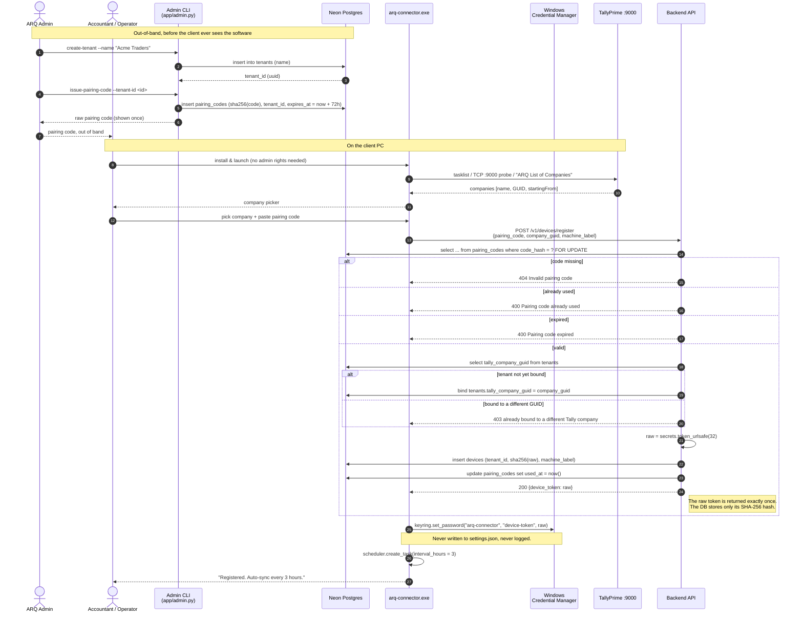

**Security properties demonstrated:** one-time code (burned via `used_at`), time-boxed
(72 h), hashed at rest (both code and token), `FOR UPDATE` prevents concurrent redemption,
permanent company-GUID binding prevents a token from ever reading a different company.

### 10.2 Flow B — Scheduled sync (the core loop, runs every N hours)

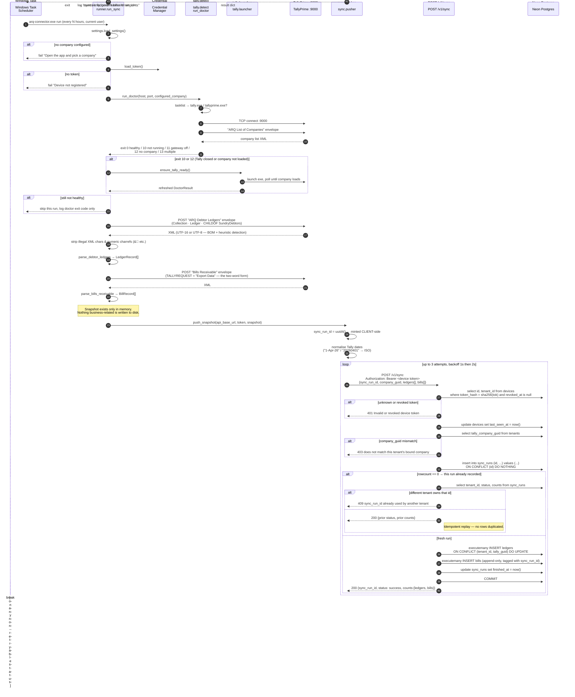

**Retry semantics.** Retryable statuses are `{500, 502, 503, 504}` only. Because
`sync_run_id` is minted before the first attempt and reused across all three, a retry after a
timeout — where the server may in fact have committed — returns the earlier result instead of
double-inserting. This is the single most important correctness property in the system.

### 10.3 Flow C — Dashboard login and metrics load

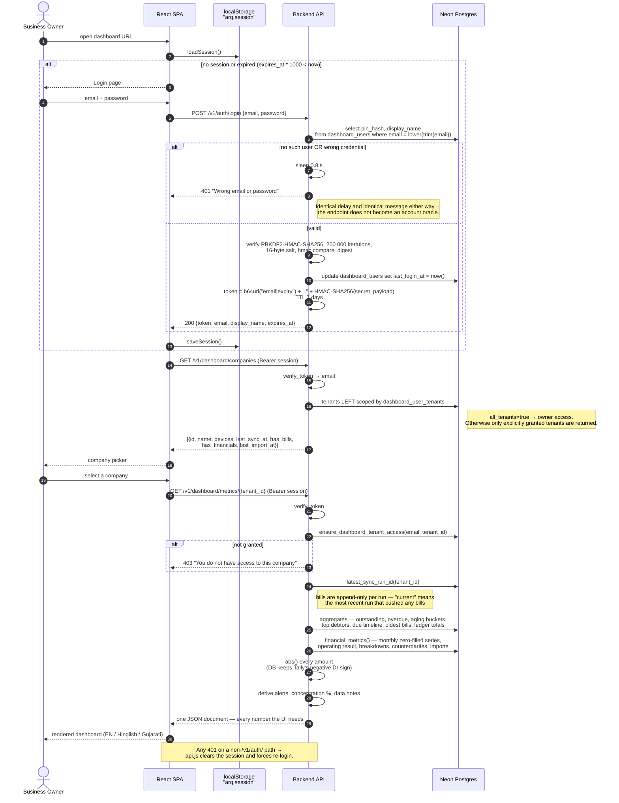

### 10.4 Flow D — Optional Excel import (Sales / Purchase / Expense)

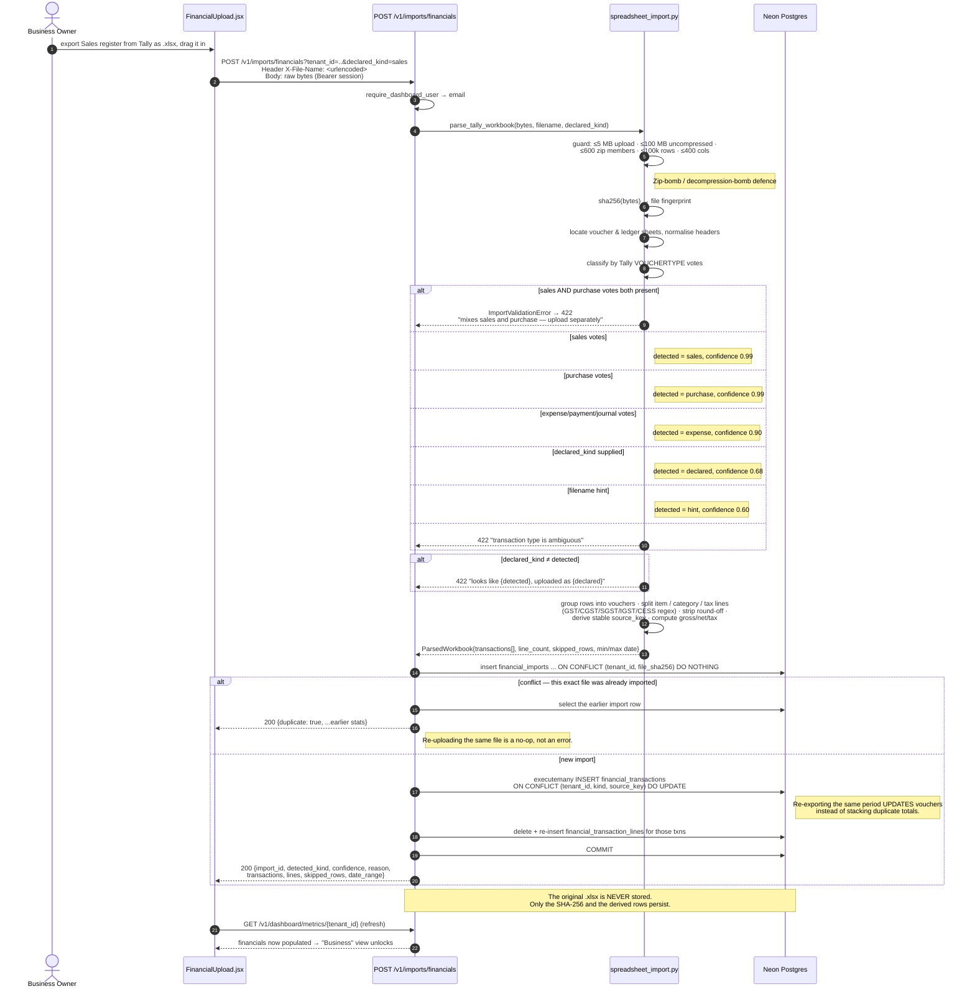

### 10.5 Flow E — AI copilot question

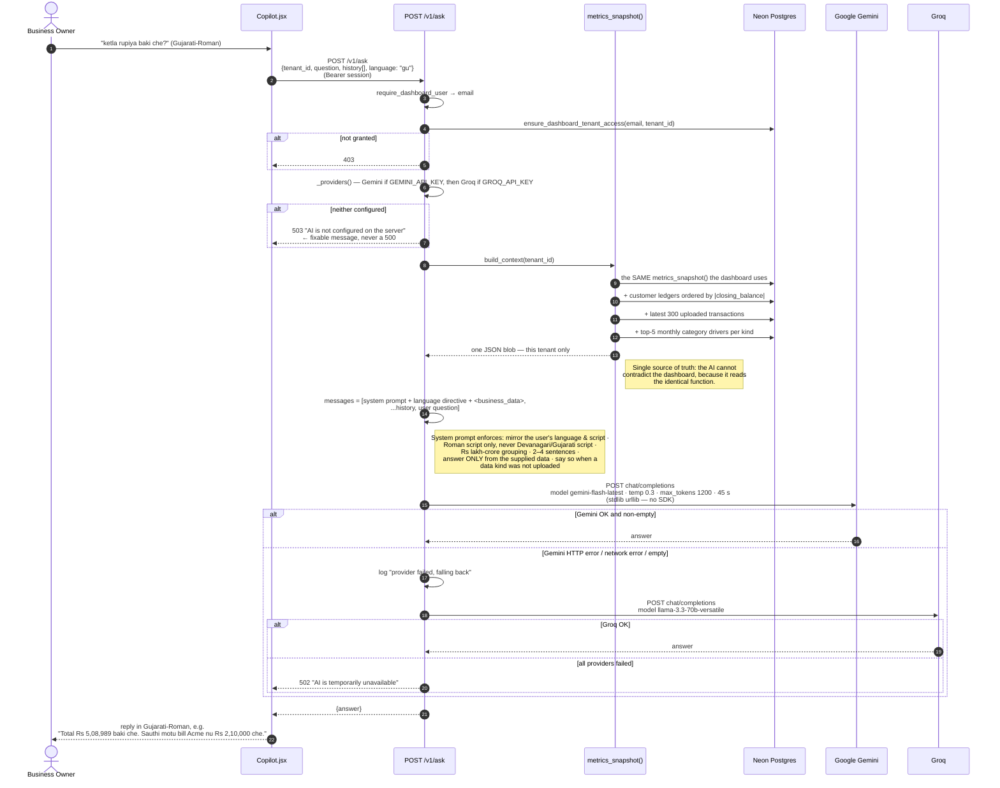

---

## 11. Data architecture

### 11.1 Entity-relationship diagram

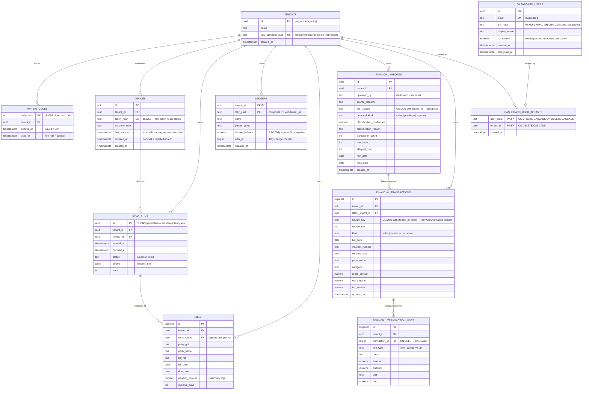

### 11.2 Two data domains, one database

The schema deliberately splits into two independent domains that share only `tenants`:

| | **Receivables domain** (connector-fed) | **Financials domain** (Excel-fed) |
|---|---|---|
| Tables | `ledgers`, `bills`, `sync_runs`, `devices`, `pairing_codes` | `financial_imports`, `financial_transactions`, `financial_transaction_lines` |
| Source | Live TallyPrime via the connector | Manual `.xlsx` upload by the dashboard user |
| Write path | `POST /v1/sync` (device token) | `POST /v1/imports/financials` (session token) |
| Cadence | Automatic, every N hours | Ad hoc, whenever the owner exports |
| Write semantics | `ledgers` upsert; `bills` **append-only** per run | Upsert by `(tenant_id, kind, source_key)` |
| Optional? | No — it is the core product | **Yes** — the dashboard works fully without it |
| Failure blast radius | Dashboard shows stale receivables | Business view simply stays empty |

This separation is why a broken Excel import can never corrupt receivables, and why a
connector outage does not affect uploaded financials.

### 11.3 Critical data semantics (the things reviewers get wrong)

| Rule | Detail | Enforced where |
|---|---|---|
| **Tally's sign is preserved** | Tally reports receivables as **negative** (Dr) amounts. `bills.pending_amount` and `ledgers.closing_balance` store the raw signed value. Every dashboard and AI number applies `abs()`. **Never "fix" the sign in the DB layer.** | `dashboard.py` module docstring; ADR-006 |
| **"Current bills" means the latest run that pushed bills** | `bills` is append-only per `sync_run_id`, so a plain `SELECT` over the table would sum every historical snapshot. `latest_sync_run_id()` scopes it. | `dashboard.latest_sync_run_id()` |
| **`sync_runs.id` is the idempotency key and is client-minted** | The connector generates the UUID before its first attempt and reuses it for every retry. | `pusher.build_payload`, `sync.py` |
| **A tenant is permanently bound to one Tally company GUID** | Set on first registration, then immutable. A valid token presenting a different GUID gets 403 on both register and sync. | `devices.py`, `sync.py` |
| **Financial vouchers are keyed by a stable `source_key`** | Derived from the Tally GUID where present, else a deterministic fallback. Re-exporting the same period updates rather than duplicates. | `spreadsheet_import._source_key` |
| **Uploaded files are never persisted** | Only `file_sha256` (for dedup) and derived rows survive the request. | `imports.py` |
| **Dashboard access is explicit** | Migration 0004 marks pre-existing owner accounts `all_tenants=true`. New users default to no access and require explicit tenant grants. | `dashauth.dashboard_user_has_tenant_access` |

### 11.4 Migration history

| Migration | Adds | Notes |
|---|---|---|
| `0001_target_schema.sql` | `tenants`, `pairing_codes`, `devices`, `sync_runs`, `ledgers`, `bills` + `bills_tenant_run_idx` | Idempotent against an already-seeded dev DB; adds missing columns with `add column if not exists` |
| `0002_dashboard_users.sql` | `dashboard_users` | Enables the web dashboard |
| `0003_financial_imports.sql` | `financial_imports`, `financial_transactions`, `financial_transaction_lines` + 5 indexes | **Must be applied before deploying code that queries finance data** |
| `0004_dashboard_user_access.sql` | `dashboard_users.all_tenants` + `dashboard_user_tenants` + tenant index | Explicit owner-wide or per-company access for dashboard logins. |

**Migration policy:** additive only, idempotent, never drops or truncates, applied manually via
`python migrations/run_migration.py <file>`. **Never applied against live Neon without the
owner's explicit go-ahead.**

### 11.5 Data retention and volumetrics

| Data | Retention | Growth driver | `[ASSUMPTION]` volume at 50 clients |
|---|---|---|---|
| `bills` | Indefinite, one row per bill **per sync run** | syncs/day × bills/company | **Fastest-growing table.** 50 clients × 200 bills × 8 syncs/day ≈ 80k rows/day ≈ 29 M rows/year. **`[GAP]` — see [§18](#18-risks-gaps-and-technical-debt), bills-dedup migration is designed but unapplied.** |
| `ledgers` | Indefinite, upserted | debtors per company | Bounded — ~50 × 200 = 10k rows steady-state |
| `sync_runs` | Indefinite | syncs/day | ~400/day at 50 clients |
| `financial_*` | Indefinite, upserted | voucher volume uploaded | Bounded by upload cadence |
| Uploaded `.xlsx` | **Never stored** | — | 0 |
| Connector logs | Local to the client PC, counts/status only | — | Negligible |

---

## 12. Integration and API contract

### 12.1 API surface

| # | Method + path | Caller | Auth | Purpose | Notable failure modes |
|---|---|---|---|---|---|
| 1 | `GET /health` | anyone / monitoring | none | Liveness | — |
| 2 | `GET /health/db` | operator, post-deploy | none | Proves Neon is reachable; returns tenant count | Returns `{"status":"error","db":"unreachable"}` rather than throwing |
| 3 | `POST /v1/devices/register` | connector | pairing code in body | Exchange a one-time code for a device token | 404 invalid · 400 used/expired · 403 GUID mismatch |
| 4 | `POST /v1/sync` | connector | `Bearer <device token>` | Ingest one snapshot | 401 invalid/revoked · 403 GUID mismatch · 409 run id owned by another tenant · **200 replay** on duplicate id |
| 5 | `POST /v1/auth/login` | SPA | email + password (legacy 4-digit PIN accepted) | Issue a 7-day HMAC session token | 400 missing credential · 401 wrong (uniform message + 0.8 s delay) |
| 6 | `GET /v1/auth/signup/status` | public SPA | none | Return availability flag and contact details; counts remain admin-only | 500 database unavailable |
| 7 | `POST /v1/auth/signup` | public SPA | none | Atomically create an isolated free trial or upsert a waitlist lead | 409 existing account · 422 invalid required fields |
| 8 | `GET /v1/dashboard/companies` | SPA | `Bearer <session>` | Companies this user may see, with sync/import status | 401 |
| 9 | `GET /v1/dashboard/metrics/{tenant_id}` | SPA | `Bearer <session>` | **Every** dashboard number in one document | 401 · 403 no access · 404 no such company |
| 10 | `POST /v1/imports/financials` | SPA | `Bearer <session>` | Classify + ingest one `.xlsx`, including conservative P&L summaries | 422 validation/classification · 404 no such company · 403 no access · **200 `duplicate:true`** on re-upload |
| 11 | `POST /v1/ask` | SPA | `Bearer <session>` | Trilingual Q&A over the tenant snapshot | 403 no access · 503 AI unconfigured · 502 all providers failed |

**Endpoint 10 note.** The workbook is sent as a **raw request body** with `tenant_id` and
`declared_kind` as query parameters and the filename URL-encoded in an `X-File-Name` header —
not multipart. Simpler to stream, and it avoids a multipart parser dependency in the lambda.

### 12.2 Outbound integrations

| Target | Protocol | Auth | Timeout / retry | Failure behaviour |
|---|---|---|---|---|
| **TallyPrime gateway** | XML over HTTP, `localhost:9000` | none (loopback) | 15 s, no retry | `TallyConnectionError` / `TallyGatewayError` (LINEERROR in body) → sync skipped, doctor exit code logged |
| **Neon Postgres** | psycopg 3 over TLS | connection string | `connect_timeout=10`, **3 attempts, sleep 1 s / 2 s / 3 s** | Raises the last `OperationalError` → caught by the JSON error middleware |
| **Google Gemini** | HTTPS chat-completions (OpenAI-compatible) | `Authorization: Bearer $GEMINI_API_KEY` | 45 s, no retry | Falls through to Groq |
| **Groq** | HTTPS chat-completions | `Authorization: Bearer $GROQ_API_KEY` | 45 s, no retry | 502 with a user-safe message |
| **ARQ Backend** (from connector) | HTTPS JSON | `Authorization: Bearer <device token>` | 60 s, **3 attempts, backoff 1 s / 2 s**, retry only on `{500,502,503,504}` | `PushError` with a plain-language message; Vercel's `FUNCTION_*` HTML is translated to "the backend had a temporary server error" |

### 12.3 Configuration contract

| Variable | Component | Bound at | Purpose |
|---|---|---|---|
| `DATABASE_URL` | backend | runtime (Vercel env / `backend/.env`) | Neon connection string with `sslmode=require&channel_binding=require` |
| `DASHBOARD_SECRET` | backend | runtime | HMAC session-signing key. **If unset, derived deterministically from `DATABASE_URL`** so all serverless instances agree without extra config. |
| `GEMINI_API_KEY` | backend | runtime | Primary LLM |
| `GROQ_API_KEY` | backend | runtime | Fallback LLM |
| `GEMINI_MODEL` / `GROQ_MODEL` | backend | runtime | Optional overrides (defaults `gemini-flash-latest`, `llama-3.3-70b-versatile`) |
| `CORS_ORIGINS` | backend | runtime | Comma-separated dashboard origins. **Currently `*`** — see [§13.4](#134-known-weaknesses-gap) |
| `VITE_API_BASE_URL` | frontend | **build time** | Inlined into the bundle by Vite. Changing it needs a **redeploy**, not an env edit. |
| `ARQ_API_BASE_URL` | connector | **build time** | Baked into the exe via `settings.DEFAULT_API_BASE_URL` before `build.ps1`. Currently `https://arcastraone.vercel.app`. |

⚠️ **Never bake a per-deployment `*-projects.vercel.app` URL into the exe.** Those sit behind
Vercel SSO and return an HTML login page instead of JSON. Only the production alias
`https://arcastraone.vercel.app` is safe.

---

## 13. Security architecture

### 13.1 Trust boundaries

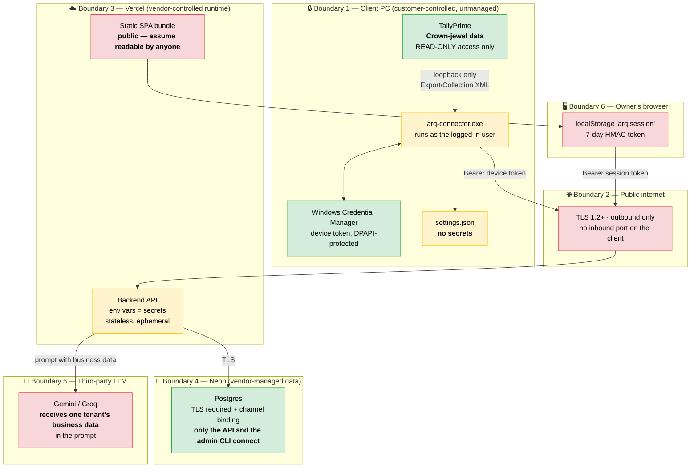

### 13.2 Authentication and authorisation matrix

| Subject | Credential | Storage (client) | Storage (server) | Lifetime | Revocation | Scope granted |
|---|---|---|---|---|---|---|
| **Pairing code** | random string shown once to the admin | none — spoken/typed | **SHA-256 hash** in `pairing_codes.code_hash` | 72 h **or** first use | automatic via `used_at`; `FOR UPDATE` blocks concurrent redemption | exactly one device registration for one tenant |
| **Device** | `secrets.token_urlsafe(32)` bearer token | **Windows Credential Manager** (never a file, never a log) | **SHA-256 hash** in `devices.token_hash` | indefinite until revoked | `revoke-device` sets `revoked_at`; checked on **every** authenticated call | write-only: `POST /v1/sync` for one tenant, **and only for the bound company GUID** |
| **Dashboard user** | email + password (4–128 chars; legacy 4-digit PINs still verify) | typed by the human | **PBKDF2-HMAC-SHA256, 200 000 iterations, 16-byte random salt**, stored `salt$digest`, compared with `hmac.compare_digest` | account lifetime | `delete-dashboard-user` | read: companies, metrics, ask; write: Excel imports |
| **Dashboard session** | `base64url("email\|expiry") + "." + HMAC-SHA256` | browser `localStorage` | **nothing — fully stateless** | **7 days**, expiry inside the signed payload | **`[GAP]` — cannot be revoked before expiry** (see §13.4) | as the user |

**Authorisation model.** Two independent checks, both applied server-side on every request:

1. **Population check** — is this a device token or a session token? The two code paths
   (`app/auth.py`, `app/dashauth.py`) never interoperate. A device token presented to
   `/v1/dashboard/*` fails signature verification; a session token presented to `/v1/sync`
   fails the `devices.token_hash` lookup.
2. **Tenant check** —
   - Devices: `tenants.tally_company_guid` must equal the `company_guid` in the payload.
   - Users: `ensure_dashboard_tenant_access(email, tenant_id)` — pre-existing owner accounts
     carry `all_tenants=true`; new users are denied until rows in `dashboard_user_tenants`
     explicitly grant the intended companies. Applied on `/metrics`, `/imports`, `/ask`, and
     folded into the `/companies` query itself.

### 13.3 Threat model (abridged STRIDE)

| # | Threat | Vector | Mitigation | Residual |
|---|---|---|---|---|
| T1 | **Tampering with the customer's books** | A bug or a malicious build issues an Import/Alter request to Tally | Only `Export` / `Collection` request types exist in `envelopes.py`. No code path constructs a mutating envelope. Reviewed as a hard invariant. | Low. Depends on code review discipline — worth a CI grep rule. |
| T2 | **Stolen device token** | Malware reads Credential Manager on the client PC | Token grants **write-only** access to `/v1/sync` for **one** bound company GUID. It cannot read the dashboard, cannot enumerate tenants, cannot read back what it pushed. Revocable instantly. | Low — an attacker could inject false receivables for that one company. Detectable via `sync_runs` anomalies. |
| T3 | **Pairing-code interception** | Code shared over WhatsApp/phone is seen by a third party | One-time use, 72 h expiry, burned atomically under `FOR UPDATE`. First use wins; the legitimate operator immediately sees "already used" and escalates. | Low, with a clear detection signal. |
| T4 | **Dashboard credential brute force** | 4-digit legacy PIN = 10 000 combinations | PBKDF2 at 200 k iterations makes offline cracking expensive; 0.8 s server-side delay + identical error message for unknown-email and wrong-password makes online guessing slow and non-enumerable. New accounts accept full passwords. | **Medium `[GAP]` — no rate limiting, no lockout.** See §13.4. |
| T5 | **Cross-tenant data access** | User A requests company B's metrics | `ensure_dashboard_tenant_access` on every tenant-scoped endpoint; `/companies` filters in SQL; new accounts are deny-by-default. | Low. Owner-wide access requires the explicit `all_tenants` flag. |
| T6 | **Session token theft via XSS** | Injected script reads `localStorage` | React escapes by default; no `dangerouslySetInnerHTML`; no third-party scripts in the bundle. | **Medium `[GAP]`** — `localStorage` is script-readable, and the token cannot be revoked before its 7-day expiry. |
| T7 | **Malicious upload (zip/decompression bomb)** | Crafted `.xlsx` | Layered guards before parsing: 5 MB upload, 100 MB uncompressed, 600 zip members, 100 k rows, 400 columns. | Low. |
| T8 | **PII leakage into logs** | Party names / amounts in log lines | Explicit convention: connector logs carry **counts and status codes only**. The payload holds the data; the log holds the shape. | Low, convention-enforced. |
| T9 | **Secret leakage into the repo** | `.env` committed | `.env` gitignored at root, `backend/`, and `frontend/`; `.env.example` files carry placeholders only. | Low — a pre-commit secret scanner would close it fully. |
| T10 | **Business data sent to a third-party LLM** | Prompt contains real party names and amounts | Only the authenticated user's own tenant data is sent. No cross-tenant mixing. Provider choice is configurable. | **Medium `[GAP]` — no customer-facing disclosure or opt-out today.** See §13.5. |
| T11 | **Unrestricted CORS** | `CORS_ORIGINS = "*"` | All endpoints require a bearer token, so a hostile origin still cannot read data without one. | **Medium `[GAP]`** — should be locked to the dashboard origin. |
| T12 | **Direct DB exposure** | Neon reachable from the internet | TLS required with channel binding; credential lives only in Vercel env and the operator's local `.env`. | Low–Medium — Neon IP allowlisting would harden it further. |

### 13.4 Known weaknesses `[GAP]`

Be explicit about these at the ARB. They are conscious trade-offs at current scale, each with
a known fix:

1. **`CORS_ORIGINS` is `*`.** Fix: set it to the dashboard origin in the Vercel project env. ~5 minutes.
2. **No rate limiting on `/v1/auth/login`.** Only the 0.8 s delay slows an attacker. Fix: Vercel WAF rate-limit rule or a `dashboard_login_attempts` table.
3. **Session tokens cannot be revoked before 7 days.** Stateless by design (P3). Fix: a `token_version` column on `dashboard_users` folded into the HMAC payload — restores revocation while keeping the token self-contained.
4. **Session token in `localStorage`.** Script-readable. Fix: `httpOnly` cookie + CSRF token — a meaningful refactor, not a config change.
5. **Legacy dashboard users see every tenant.** Correct for the owner account, dangerous the moment a client account is created without a grant row. Fix: make grants mandatory and migrate existing accounts.
6. **Backend tests hit the live Neon database.** Not hermetic; a test run mutates production-adjacent data. Fix: a dedicated Neon test branch (Neon branching makes this cheap).
7. **No structured audit log.** `devices.last_seen_at`, `dashboard_users.last_login_at` and `sync_runs` give partial coverage; there is no record of who viewed what.
8. **Legacy four-digit PIN accounts remain valid.** Rotate them to strong passwords as the remaining owner accounts are reviewed.

### 13.5 Data classification and flow to third parties

| Class | Examples | Where it lives | Leaves the system to |
|---|---|---|---|
| **Confidential — customer business data** | party names, bill refs, outstanding amounts, sales/purchase/expense vouchers | Neon Postgres; transiently in the connector's memory and the browser | **Gemini / Groq** in the `/v1/ask` prompt |
| **Secret** | device tokens, pairing codes, password hashes, `DATABASE_URL`, LLM API keys | Windows Credential Manager (client) · Vercel env vars (server) · hashed columns (DB) | never |
| **Internal** | sync counts, run IDs, doctor exit codes, classification confidence | DB, logs | never |
| **Public** | the SPA bundle, `/health` | Vercel CDN | — |

**LLM data-sharing note for the ARB.** `/v1/ask` serialises the authenticated user's **own
tenant** snapshot — including real party names and real amounts — into the prompt sent to
Google or Groq. This is a deliberate design choice (the snapshot is small enough to fit,
which avoids giving a model direct database access). It should be **disclosed in the product's
privacy policy**, and enterprise-grade alternatives exist if a customer objects: Vercel AI
Gateway with a zero-data-retention provider, or a self-hosted model. `[GAP]` — no disclosure
exists today.

---

## 14. Deployment architecture

### 14.1 Deployment topology

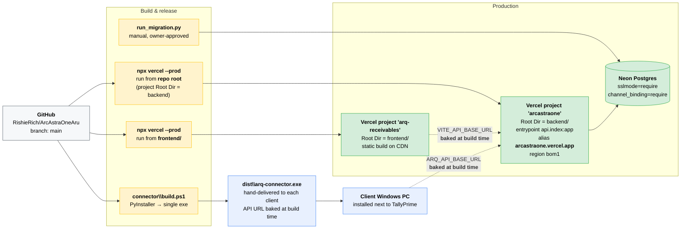

### 14.2 Environments

| Environment | Backend | Frontend | Database | Connector |
|---|---|---|---|---|
| **Local dev** | `uvicorn app.main:app --port 8010` (a dead-PID socket squats on :8000 on the dev machine) | `npm run dev` → :5173, falls back to `http://127.0.0.1:8010` | **the same live Neon DB** `[GAP]` | `python -m arq_connector.cli` from its own venv |
| **Production** | Vercel `arcastraone`, alias `arcastraone.vercel.app` | Vercel `arq-receivables` | Neon | `dist\arq-connector.exe` on each client PC |
| **Staging** | **does not exist** `[GAP]` | — | — | — |

### 14.3 Release procedure (verified 2026-07-25)

```powershell
# 1. Land the change
git push origin main

# 2. Apply any pending migration FIRST — owner-approved, never unilateral
cd backend; python migrations\run_migration.py migrations\000N_xxx.sql

# 3. Backend — run from the REPOSITORY ROOT.
#    The Vercel project already has Root Directory = backend;
#    running from backend/ incorrectly resolves backend/backend.
npx vercel@latest link --project arcastraone --yes
npx vercel@latest --prod --yes

# 4. Frontend — its linked project deploys from frontend/
cd frontend
npx vercel@latest --prod --yes

# 5. Verify, in this order
curl https://arcastraone.vercel.app/health       # {"status":"ok"}
curl https://arcastraone.vercel.app/health/db    # proves Neon is reachable + tenant count

# 6. Connector, only when connector code changed
cd connector; .\build.ps1                        # → dist\arq-connector.exe
```

### 14.4 Deployment constraints and traps

| Trap | Detail |
|---|---|
| **Git auto-deploy is unreliable here** | Neither Vercel project auto-deployed on the 2026-07-25 push; both still showed 13-day-old deployments. **Deploy manually until the Git integrations are repaired.** `[GAP]` |
| **There is no `vercel.json`** | Configuration lives in `backend/pyproject.toml` (`[tool.vercel]`) plus the Vercel project settings. |
| **The Python builder ignores `requirements.txt`** | When a `[project]` section exists it installs from `[project].dependencies`. **Keep both lists in sync** or the build silently lacks a package. `openpyxl` is the live example. |
| **`entrypoint` must be declared** | The FastAPI preset finds several ASGI `app` objects (`api/index.py`, `app/main.py`, `tests/conftest.py`) and refuses to guess. `[tool.vercel] entrypoint = "api.index:app"`. |
| **Root Directory must be exactly right** | `backend` for the API project, `frontend` for the SPA project. |
| **Per-deployment URLs are behind SSO** | `*-projects.vercel.app` returns an HTML SSO page, not JSON. Test and bake only the alias. |
| **Frontend and connector config is build-time** | `VITE_API_BASE_URL` and `ARQ_API_BASE_URL` are inlined at build. Changing them requires a rebuild/redeploy, not an env edit. |
| **Connector distribution is manual** | The exe is hand-delivered. There is **no auto-update channel** `[GAP]` — a connector fix requires contacting every client. |

### 14.5 Rollback

| Component | Rollback |
|---|---|
| Backend | Vercel instant rollback to the previous deployment (or Rolling Releases for a staged rollout) |
| Frontend | Same |
| Database | **No down migrations.** Migrations are additive, so the previous backend version keeps working against the newer schema — that is the intended rollback path. |
| Connector | Re-issue the previous exe manually to affected clients |

---

## 15. Reliability, performance and cost

### 15.1 Failure modes and system response

| Failure | Detection | Response | User impact |
|---|---|---|---|
| Tally closed at sync time | `run_doctor` exit 10 | `ensure_tally_ready` launches Tally and waits | None if the launch succeeds |
| Tally in Educational mode | Company never loads | Sync skipped, exit code logged | **Unattended sync does not work.** Licensed TallyPrime with `Default Companies=Yes` + `Load=<n>` is required — a Tally limitation, not a bug |
| Client PC off / offline | `httpx.RequestError` after 3 attempts | Run skipped; next scheduled run retries | Data goes stale until the PC is back |
| Neon compute suspended (~5 min idle, free tier) | `psycopg.OperationalError` on connect | **3 connect attempts** with 1 s/2 s/3 s sleeps, `connect_timeout=10` | Typically invisible — the wake-up completes within the retry window |
| Unhandled backend exception | Catch-all middleware in `main.py` | Always returns JSON `{"detail": ...}`, never Vercel's opaque `FUNCTION_INVOCATION_FAILED` HTML | Actionable error message; the connector's `_error_detail` translates it further |
| Transient backend 5xx during push | Status in `{500,502,503,504}` | 3 attempts, exponential backoff, **same `sync_run_id`** | Invisible; a committed-then-timed-out first attempt replays safely |
| Gemini down or rate-limited | HTTP/network error or empty answer | Transparent fallback to Groq | Slightly different answer style; no visible failure |
| Both LLMs down | Both providers failed | 502 "AI is temporarily unavailable" | Copilot unavailable; **all dashboard numbers still work** |
| LLM keys unset | `_providers()` empty | 503 with a fixable message | Copilot disabled; rest of the product unaffected |
| Bad `.xlsx` upload | `ImportValidationError` | 422 with a specific, actionable message | User re-exports correctly |
| Duplicate `.xlsx` upload | `file_sha256` conflict | 200 `duplicate: true` with the earlier stats | Reassuring no-op, not an error |
| Session expired | 401 on any non-auth path | `api.js` clears the session and forces login | Re-login |

### 15.2 Performance characteristics

| Path | Characteristic | Design lever |
|---|---|---|
| Snapshot push | Two `executemany` batches, not per-row inserts | psycopg 3 pipelining — one round trip per batch |
| Metrics load | One connection, a handful of aggregate queries, all computation in SQL | Keeps the serverless function short; no Python row loops |
| Cold start | Lean dependency set: FastAPI, psycopg, pydantic, dotenv, openpyxl — **no LLM SDK** | ADR-007 |
| Copilot | 45 s budget, `max_tokens` 1200, `temperature` 0.3, latest 300 transactions only | Bounded prompt size |
| SPA | React + Vite, no UI/state/chart libraries | Minimal bundle over Indian mobile networks |

`[GAP]` **None of these are measured.** There is no load test, no latency budget, no APM. For
the ARB, present them as design intent with instrumentation as a roadmap item.

### 15.3 Scaling analysis

| Dimension | Today | First thing that breaks | Fix |
|---|---|---|---|
| Clients (tenants) | Single digits | Neon free-tier compute hours as concurrent syncs rise | Neon paid tier; stagger sync schedules across clients |
| `bills` row growth | Every sync appends a full snapshot | **This is the real scaling limit.** ~29 M rows/year at 50 clients `[ASSUMPTION]` | The designed-but-unapplied **bills-dedup migration** (`DATA_MODEL.md`) |
| Serverless concurrency | Well within Hobby limits | Vercel Hobby function limits | Pro plan; Fluid Compute already reuses instances |
| LLM volume | Ad hoc, per question | Gemini free-tier quota | Paid tier or Vercel AI Gateway with failover + spend tracking |
| Prompt size | Snapshot serialised whole | A large tenant's snapshot exceeding the context window | Switch `/v1/ask` from snapshot-in-prompt to tool-use against the DB — **already anticipated in `ask.py`'s docstring** |

### 15.4 Cost model

| Component | Tier | Cost today | Cost driver at scale |
|---|---|---|---|
| Vercel — backend | Hobby | ₹0 | Active CPU time, provisioned memory, invocations |
| Vercel — frontend | Hobby | ₹0 | Bandwidth |
| Neon Postgres | Free | ₹0 | Compute hours + storage; `bills` growth drives storage |
| Gemini | Free tier | ₹0 | Tokens per question |
| Groq | Free tier | ₹0 | Fallback only |
| GitHub | Free | ₹0 | — |
| Connector distribution | Manual | ₹0 | Your time — the real cost |
| **Total** | | **₹0/month** | First paid tier will be Neon, driven by `bills` growth |

---

## 16. Observability and operations

### 16.1 What exists today

| Signal | Where | Content |
|---|---|---|
| Backend request/error logs | Vercel dashboard (`vercel logs`) | `logger.exception` on every unhandled error, with method + path |
| AI provider failures | Vercel logs | `[ask] provider failed, falling back -> ...` and `[ask] all providers failed: [...]` |
| Connector logs | Local file on the client PC via `logging_setup.py` | **Counts and statuses only** — `sync ok: ledgers=N bills=M run_id=...`. Never party names or amounts. |
| Liveness | `GET /health` | `{"status":"ok"}` |
| DB reachability | `GET /health/db` | `{"status":"ok","db":"reachable","tenants":N}` |
| Device heartbeat | `devices.last_seen_at` | Touched on every authenticated device call |
| Sync history | `sync_runs` | Per-run status, counts JSONB, timing, error |
| Import history | `financial_imports` | Filename, detected kind, confidence, reason, row counts, date range |
| Login activity | `dashboard_users.last_login_at` | Last successful login |
| Incident dating | Vercel error-page IDs | `bom1::xxx-<ms>-...` embeds a **millisecond epoch** — you can date an incident from a screenshot |

### 16.2 Operational runbook

| Situation | Diagnostic sequence |
|---|---|
| **"The dashboard is broken"** | `GET /health` → `GET /health/db` → Vercel logs → confirm `DATABASE_URL` is set on the project |
| **"A client's data is stale"** | `GET /v1/dashboard/companies` → check `last_sync_at` and `devices` count → on the client PC run `arq-connector doctor` → read the exit code (10 not running · 11 gateway off · 12 no company · 13 multiple) |
| **"Sync says 0 ledgers / 0 bills"** | Either an empty test company **or** the Tally XML shape doesn't match `parse_bills_receivable`. Capture the raw XML from that machine and compare against `connector/tests/fixtures/`. **This is the live open item — see [§18](#18-risks-gaps-and-technical-debt).** |
| **"The copilot stopped answering"** | 503 → `GEMINI_API_KEY`/`GROQ_API_KEY` missing on the Vercel project. 502 → both providers failed; grep logs for `[ask]`. |
| **"A client lost their laptop"** | `python -m app.admin list-tenants` → find the device → `revoke-device --device-id <id>`. The next push gets 401 immediately. |
| **"A new client needs onboarding"** | `create-tenant` → `issue-pairing-code` → send the exe + code → they register → optionally `create-dashboard-user` + `grant-dashboard-access` |
| **Post-deploy sanity** | `GET /health` then `GET /health/db`, in that order |

### 16.3 Observability gaps `[GAP]`

No uptime monitoring or alerting on `/health`. No error-rate or latency dashboards. No alert
when a client's sync silently stops — **today you find out because the customer tells you**.
No per-tenant usage analytics. No audit trail of dashboard views.

**Lowest-effort, highest-value fix:** a scheduled job that queries
`sync_runs`/`devices.last_seen_at` and alerts when any active tenant has not synced within
2× its configured interval. That single check covers the most damaging silent failure mode
in the product.

---

## 17. Architecture Decision Records (ADRs)

| # | Decision | Context | Alternatives rejected | Consequences |
|---|---|---|---|---|
| **ADR-001** | **Agent-based extraction over any direct integration** | TallyPrime is a desktop app on an unmanaged PC behind NAT. It has no cloud API, no webhooks, and cannot initiate an outbound push itself. | Tally cloud sync (doesn't exist for this data) · ODBC over VPN (needs network engineering per client) · manual export (defeats the purpose) | An installable exe per client, and a client-side distribution/update problem. Accepted as unavoidable. |
| **ADR-002** | **Read-only, forever** | The customer's books are their most valuable asset; a write bug would be existential for trust. | Bidirectional sync (marking bills paid from the dashboard) | Only `Export`/`Collection` envelopes exist. The product can never *act* on Tally — only observe. Accepted as the price of trust. |
| **ADR-003** | **Snapshot push, not change-data-capture** | Tally exposes an `ALTERID` change counter, but full snapshots are simpler and self-healing. | Incremental sync on `ALTERID` | Higher bandwidth and, more importantly, **`bills` row growth** — the source of the pending dedup migration. Accepted for simplicity; revisit at scale. |
| **ADR-004** | **Stateless HMAC session tokens** | Serverless means every invocation is a fresh process; a server-side session store would add a component to operate. | Server-side sessions (needs Redis) · JWT library (another dependency for the same thing) | ~40 lines, zero infrastructure. **Cost: tokens cannot be revoked before their 7-day expiry** — see §13.4 item 3. |
| **ADR-005** | **Client-generated `sync_run_id` as the idempotency key** | A push can time out *after* the server commits. Without an idempotency key, the retry double-counts every bill. | Server-generated IDs (can't dedup a retry) · content hashing (breaks on any timestamp field) | `on conflict do nothing` + `rowcount == 0` detection is **race-safe**: a concurrent retry blocks on the first transaction rather than raising a unique violation. The strongest correctness property in the system. |
| **ADR-006** | **Store Tally's raw sign; `abs()` at the presentation boundary** | Tally reports receivables as negative (Dr) balances. | Normalising to positive on write | The DB never disagrees with Tally, which makes reconciliation with the customer's own reports trivial. Every read path must remember to `abs()` — documented at the top of `dashboard.py`. |
| **ADR-007** | **No LLM SDK — stdlib `urllib` against OpenAI-compatible endpoints** | Vercel cold-start weight is a real cost, and both providers speak the same dialect. | `google-generativeai` + `groq` SDKs (two heavy dependencies) · LangChain (very heavy, unnecessary abstraction) | ~60 lines of `urllib` serve both providers and make failover trivial. **Cost:** manual handling of provider-specific quirks. |
| **ADR-008** | **Retry the Neon connection and catch every exception at the ASGI boundary** | Neon free tier suspends compute after ~5 min idle; the first connect during wake-up failed, and the escaped exception produced Vercel's opaque `FUNCTION_INVOCATION_FAILED` HTML page. | Keep-alive pinger (burns free-tier compute hours) · paid Neon tier (cost) | `db.py` retries 3×; `main.py` middleware guarantees a JSON body always. **Do not remove either.** Full writeup: `ERROR101_RESOLUTION.md`. |
| **ADR-009** | **Snapshot-in-prompt for the AI, not tool-use against the DB** | One tenant's normalized snapshot is small enough to serialise into a prompt. | Function calling / tool use against Postgres · RAG with a vector store | Dramatically simpler, and it **guarantees the AI and the dashboard agree** (both read `metrics_snapshot()`). **Cost:** bounded by context window — the migration path to tool-use is already noted in `ask.py`. |
| **ADR-010** | **Two isolated auth schemes for devices and humans** | Devices and dashboard viewers are different populations with different lifetimes, threat models and revocation needs. | One unified auth system | Two small modules instead of one general one. Neither population can impersonate the other, by construction. |
| **ADR-011** | **Excel import as an optional parallel domain** | Tally's XML gateway exposes receivables well but sales/purchase/expense extraction is far harder; the owner already exports these to Excel routinely. | Extending the connector to pull vouchers via XML | Business-flow metrics shipped without touching the connector. **Cost:** manual upload, plus the unresolved voucher-cancellation semantics in §18. |
| **ADR-012** | **Mono-repo, three deploy targets** | The wire contract (`schemas.py` ↔ `pusher.build_payload`) must change in one atomic commit. | Three repositories | Cannot break the contract across repos. **Cost:** unrelated CI/deploys are coupled — mitigated by Vercel's Root Directory setting. |
| **ADR-013** | **No UI framework, no state library, no chart library** | Trilingual layout and Indian number formatting need total control; bundle size matters on Indian mobile networks. | Material UI / Tailwind + shadcn · Redux/Zustand · Recharts | Zero dependency churn, tiny bundle. **Cost:** every component is hand-written. |
| **ADR-014** | **Additive-only, hand-run SQL migrations** | Four migrations against a live seeded DB with real customer data. | Alembic · auto-migrate on deploy | Every migration is safe to re-run and safe to deploy *before* the code that uses it. **Deliberately never automated** — a migration against live Neon requires the owner's explicit go-ahead. |

---

## 18. Risks, gaps and technical debt

### 18.1 Open functional issues

| Item | Detail | Impact | Next action |
|---|---|---|---|
| **Colleague test tenant syncs 0 ledgers / 0 bills** (device `quaidjohar`) | Either an empty test company, or that Tally's XML shape doesn't match `parse_bills_receivable`. The parser is live-verified against **exactly one** bill layout; how multiple bills repeat in the response is **inferred, not confirmed**. | **The single biggest product risk.** If real Tally installations vary in bill layout, the core extraction silently returns nothing — and it fails *quietly*, reporting success with zero rows. | Obtain their real-company push or a raw XML dump; add it as a second fixture; broaden the parser. |
| **`bills` dedup migration designed but unapplied** | Repeated syncs stack duplicate bill rows. Design is in `DATA_MODEL.md`, awaiting the owner's go-ahead. | Unbounded table growth; the first thing to hit a paid Neon tier. | Owner decision, then apply during a low-traffic window. |
| **Excel voucher removals/cancellations** | Re-exports update vouchers that keep the same Tally GUID, but a voucher **absent** from a later workbook is never deleted. | A cancelled voucher silently persists in the business view. | Add an explicit snapshot/reconciliation workflow before treating imports as a cancellation ledger. |

### 18.2 Risk register

| # | Risk | Likelihood | Impact | Mitigation / owner action |
|---|---|---|---|---|
| R1 | **Tally XML shape varies across installations** and the parser silently returns zero rows | **High** | **High** | Collect fixtures from every new client during onboarding; add an alert when a sync succeeds with 0 bills for a tenant that previously had bills |
| R2 | Client PC is off/asleep at every scheduled sync | High | Medium | Multiple runs per day; dashboard shows `last_sync_at` prominently; add a staleness alert (§16.3) |
| R3 | **Educational-mode Tally** blocks unattended sync entirely | Medium | High | Documented Tally limitation; require licensed TallyPrime with `Default Companies=Yes` + `Load=<n>` as an onboarding prerequisite |
| R4 | Neon free tier exhausted as clients grow | Medium | Medium | Apply the dedup migration; budget for the Neon paid tier |
| R5 | LLM free-tier quota exhausted | Medium | Low | Groq fallback already absorbs it; copilot degrades independently of the dashboard |
| R6 | **Vercel Git auto-deploy is currently broken** — a push does not deploy | **Confirmed** | Medium | Manual `npx vercel --prod` documented in §14.3; repair the Git integrations |
| R7 | **No staging environment**; local dev runs against the live DB | **Confirmed** | Medium | Create a Neon branch for dev/test; point local `.env` and backend tests at it |
| R8 | **No connector auto-update channel** | Confirmed | Medium | Every connector fix requires contacting each client. Consider a version check against `/health` and an in-GUI update prompt |
| R9 | Single-region deployment (`bom1`) | Low | Low | Acceptable — the user base is Indian |
| R10 | **Bus factor of one** — one developer, deep undocumented context | **High** | **High** | `AGENTS.md` + `magic_mds/` + **this document** are the mitigation. Keep them current. |
| R11 | Customer business data sent to third-party LLMs without disclosure | Medium | Medium | Add a privacy disclosure; offer a copilot opt-out; evaluate a zero-data-retention provider |
| R12 | No rate limiting on login | Medium | Medium | Vercel WAF rate-limit rule on `/v1/auth/login` |

### 18.3 Technical debt ledger

| Debt | Interest being paid | Effort to clear |
|---|---|---|
| Backend tests hit the live Neon DB | Cannot run tests freely; risk of mutating real data | **Low** — Neon branch + test `DATABASE_URL` |
| `CORS_ORIGINS = "*"` | Weaker defence in depth | **Trivial** — one env var |
| No staging environment | Every deploy is to production | **Low** — a Vercel preview project + a Neon branch |
| `AGENTS.md` §4 predates migration 0004 | Next agent/human gets a stale security model | **Trivial** — a doc edit |
| No CI pipeline | Tests run only when remembered | **Low** — GitHub Actions running both pytest suites |
| No monitoring/alerting | Silent failures found by the customer | **Low** — uptime check + a stale-sync query |
| `bills` append-only growth | Storage and query cost compounding | **Medium** — the designed dedup migration |
| Session revocation impossible | A compromised token is valid for 7 days | **Medium** — `token_version` in the HMAC payload |
| Manual connector distribution | Every client fix is a phone call | **Medium** — version check + update prompt |

---

## 19. Roadmap

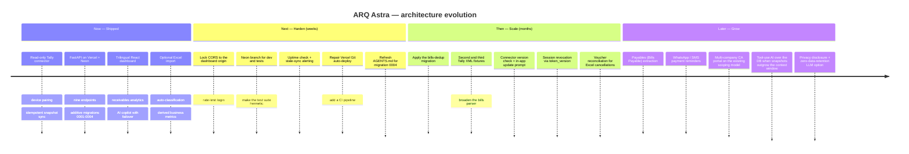

---

## 20. ARB deck blueprint

> **This is the section to act on when asked for "the ARB deck".**
> Target: **20 slides**, ~30–40 minutes with Q&A. Every slide names its source section.

| # | Slide | Content | Source |
|---|---|---|---|
| 1 | **Title** | ARQ Astra — End-to-End Solution Architecture · owner · date · status: *Production-live* | Header |
| 2 | **Executive summary** | The problem in one line, the solution in three bullets, the one hard constraint that shapes everything (Tally is a desktop app with no cloud API) | §1 |
| 3 | **Business context** | Personas table + the five business drivers and their architectural consequences | §2.1–2.2 |
| 4 | **Scope** | In-scope / out-of-scope, two columns. Be explicit about what the system deliberately does *not* do | §2.3 |
| 5 | **Requirements** | FR table (condensed to 12 rows) + the NFR table with targets and current status | §3 |
| 6 | **Design principles** | The P1–P10 table — *this is the slide that explains every later decision* | §4.2 |
| 7 | **C4 L1 — System Context** | The context Mermaid diagram. Emphasise: only two external systems, and the Tally arrow is read-only | §5 |
| 8 | **C4 L2 — Containers** | The container Mermaid diagram + the responsibility table | §6 |
| 9 | **C4 L3 — Backend components** | The backend component diagram. Call out `metrics_snapshot()` as the single read model shared by the dashboard and the AI | §7.1 |
| 10 | **C4 L3 — Connector components** | The connector component diagram. Call out the Tally adapter as an anti-corruption layer | §7.2 |
| 11 | **Technology stack** | The full stack table + **§9.2 deliberate non-choices** — reviewers respect explicit non-choices more than choices | §9 |
| 12 | **Flow — Onboarding & pairing** | Sequence diagram A. Emphasise: one-time code, hashed at rest, permanent company binding | §10.1 |
| 13 | **Flow — The core sync loop** | Sequence diagram B. **The most important slide.** Emphasise idempotency: client-minted `sync_run_id` makes retries free | §10.2 |
| 14 | **Flow — Dashboard & AI** | Combine sequence C (condensed) and sequence E. Emphasise that the AI reads the *identical* function as the dashboard | §10.3, §10.5 |
| 15 | **Data architecture** | The ERD + the two-domain split table | §11.1–11.2 |
| 16 | **Data semantics** | The seven "things reviewers get wrong" rules — sign preservation, latest-run scoping, idempotency key, GUID binding, `source_key`, no file retention, legacy access | §11.3 |
| 17 | **Security architecture** | Trust-boundary diagram + the auth matrix | §13.1–13.2 |
| 18 | **Threat model & known gaps** | The STRIDE table (condensed to the top 8) **and §13.4 verbatim.** Do not soften the gaps — an ARB rewards candour | §13.3–13.5 |
| 19 | **Deployment & operations** | Deployment topology diagram + release procedure + the runbook table | §14, §16 |
| 20 | **ADRs, risks & roadmap** | The ADR log (condensed to the 8 most consequential), the risk register, and the roadmap timeline | §17–§19 |

### 20.1 Optional appendix slides

- **A1** — C4 L3 Frontend components (§7.3)
- **A2** — Logical capability view (§8)
- **A3** — Excel import flow in full (§10.4)
- **A4** — Migration history + retention/volumetrics (§11.4–11.5)
- **A5** — Full API contract table (§12.1)
- **A6** — Cost model + scaling analysis (§15.3–15.4)
- **A7** — Technical debt ledger (§18.3)

### 20.2 Anticipated ARB questions — and the answers

| Question | Answer | Section |
|---|---|---|
| *"Why an agent on the customer's PC? That's a support burden."* | Tally has no cloud API, no webhooks, and cannot initiate outbound calls. It is a desktop app behind NAT. There is no alternative that doesn't require per-client network engineering. | ADR-001 |
| *"How do you guarantee you never corrupt the customer's books?"* | Only `Export` and `Collection` XML request types exist in the codebase. No code path constructs a mutating envelope. It is a reviewed invariant, and a candidate for a CI grep rule. | ADR-002, T1 |
| *"What happens when a sync retries after a timeout?"* | The connector mints the `sync_run_id` before its first attempt and reuses it. The server does `on conflict do nothing` and, on `rowcount == 0`, returns the earlier result. Race-safe: a concurrent retry blocks on the first transaction rather than erroring. | ADR-005, §10.2 |
| *"Why no message queue?"* | The entire pipeline is one client-initiated HTTP call per sync, a few times a day per client. A queue adds an operated component for zero benefit at this volume. | §9.2 |
| *"Is customer data sent to a third-party AI?"* | Yes — the authenticated user's own tenant snapshot is serialised into the prompt to Gemini or Groq. It is a deliberate choice that avoids giving the model DB access, and it needs a privacy disclosure. That is an acknowledged gap. | §13.5, T10 |
| *"How do you revoke access?"* | Devices: instantly, via `revoke-device` — checked on every request. Dashboard sessions: **you cannot before the 7-day expiry.** Known gap, with a designed fix (`token_version` in the HMAC payload). | §13.2, §13.4 |
| *"What's your biggest architectural risk?"* | The bills parser is live-verified against exactly one Tally bill layout, and it fails *silently* — reporting success with zero rows. A second real-world fixture is the top priority. | R1, §18.1 |
| *"Where does this break first as you grow?"* | `bills` table growth. Every sync appends a full snapshot; the dedup migration is designed but awaiting go-ahead. | §15.3, R4 |
| *"Do you have a staging environment?"* | No. Local dev runs against the live Neon DB and backend tests are not hermetic. Fix is cheap — a Neon branch — and it is on the Next roadmap. | R7, §14.2 |
| *"How would a second engineer onboard?"* | `AGENTS.md` is the working brief, `magic_mds/` holds the deep dives, and this document is the architecture source of truth. Bus factor is an acknowledged high risk. | R10 |

---

## 21. Appendix

### 21.1 Glossary

| Term | Meaning |
|---|---|
| **Tenant** | One customer company. The unit of data isolation. Permanently bound to one Tally company GUID. |
| **Device** | One installation of the connector, authorised to push for exactly one tenant. |
| **Pairing code** | A one-time, 72-hour, admin-issued secret that a device exchanges for a device token. |
| **Snapshot** | The full set of debtor ledgers + outstanding bills at one moment, pushed as a single `/v1/sync` call. |
| **Sync run** | One snapshot push, identified by a client-generated UUID that is also the idempotency key. |
| **Doctor** | The connector's Tally health check: process → port → gateway → company match, with distinct exit codes. |
| **Ledger** | A Tally Sundry Debtor account (a customer who owes money). |
| **Bill** | One outstanding receivable line item, with a due date and an overdue-day count. |
| **Aging bucket** | Outstanding grouped by how overdue it is. |
| **Voucher** | A Tally transaction record (sale, purchase, payment, journal) — the unit of the Excel import. |
| **`source_key`** | The stable per-voucher identity used for Excel upserts: the Tally GUID where present, else a deterministic fallback. |
| **Hinglish** | Hindi written in Roman script (e.g. "kitna paisa fansa hai"). A first-class UI language. |
| **Gujarati-Roman** | Gujarati written in Roman script (e.g. "ketla rupiya baki che"). A first-class UI language. |
| **Lakh-crore grouping** | Indian digit grouping: `₹1,25,000` not `₹125,000`; `₹1,00,00,000` = 1 crore. |
| **ARB** | Architecture Review Board — the governance forum this deck is prepared for. |
| **C4** | Context / Container / Component / Code — Simon Brown's architecture diagram model. |

### 21.2 Source-of-truth map

| Concern | Authoritative file |
|---|---|
| **Agent/developer working brief** | `AGENTS.md` (repo root; `CLAUDE.md` is a pointer to it) |
| **This architecture** | `magic_mds/SOLUTION_ARCHITECTURE.md` |
| API contract | `backend/app/schemas.py`, `backend/app/schemas_ask.py`, `backend/app/routers/` |
| Wire payload construction | `connector/src/arq_connector/sync/pusher.py` |
| Database schema | `backend/migrations/0001`–`0004` |
| Metrics definitions | `backend/app/routers/dashboard.py` (`metrics_snapshot`, `financial_metrics`) |
| Excel classification rules | `backend/app/spreadsheet_import.py` |
| AI behaviour & prompt | `backend/app/routers/ask.py` (`SYSTEM`) |
| Tally request envelopes | `connector/src/arq_connector/tally/envelopes.py` |
| Tally response parsing | `connector/src/arq_connector/tally/parsers.py` |
| UI strings (all 3 languages) | `frontend/src/i18n.js` |
| Deploy procedure | `magic_mds/VERCEL_DEPLOY.md` + §14 here |
| Neon cold-start incident | `magic_mds/ERROR101_RESOLUTION.md` |
| Data model + pending dedup design | `magic_mds/DATA_MODEL.md` |
| Dashboard number definitions | `magic_mds/DASHBOARD_TABLE_REFERENCE.md` |
| End-user install guide | `magic_mds/USER_MANUAL.md`, `magic_mds/CONNECTOR_SETUP.md` |
| Excel import setup | `magic_mds/EXCEL_IMPORT_SETUP.md` |
| Tally test fixtures | `magic_mds/TALLY_TEST_DATA.md`, `connector/tests/fixtures/` |

### 21.3 Open questions for the ARB

1. Should the **bills-dedup migration** be applied now, or is unbounded `bills` growth acceptable until the client count reaches a set threshold? *(Owner decision — see R4, §18.1.)*
2. What is the acceptable **data-staleness SLA**? The default is 3 hours; is that a product promise or just a default?
3. Does the **LLM data-sharing** posture need a customer-facing disclosure and an opt-out before the next client onboards?
4. Should **connector auto-update** be built before or after the next batch of clients? The manual-distribution cost scales linearly with client count.
5. Is **single-region (`bom1`)** deployment acceptable indefinitely given an Indian-only user base?
6. What is the **incident-response expectation** — who is on call, and what is the target time-to-detect for a silent sync failure?

---

*End of document. Maintained alongside `AGENTS.md`; when architecture, endpoints, schema,
deploy config, or security posture changes, update both and bump the version and date at the top.*
